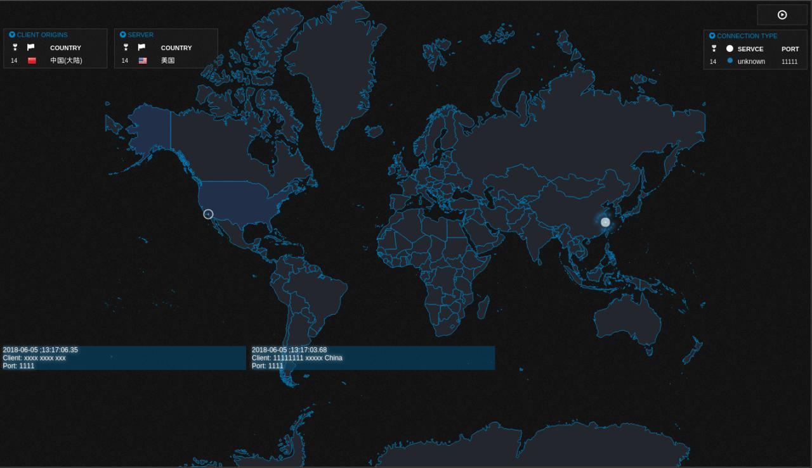

# WolfMonitor
[](http://forthebadge.com)  

## Screenshot



## How to use

- _config/config.py_

```python
SERVER_IP = "0.0.0.0" # your server address
SERVER_PORT = "9999" # websocket listen port
MONITOR_PORT = "443" # which port your wanna monitor
```

- _html/script/ipviking.js_

```js
    wsHost: "ws://127.0.0.1:9999/ws", // websocket address & port
```

- _build the nginx docker_

```shell
docker build .
docker run -d -p 80:80 xxx
```

- _run websocket server_

```shell
python3 -m pip install -r requirement.txt
nohup python3 main.py &
```

## Depends

> [ipviking](https://github.com/TingGe/data-visualization/tree/master/ipviking)

> [netstat](https://github.com/da667/netstat)
